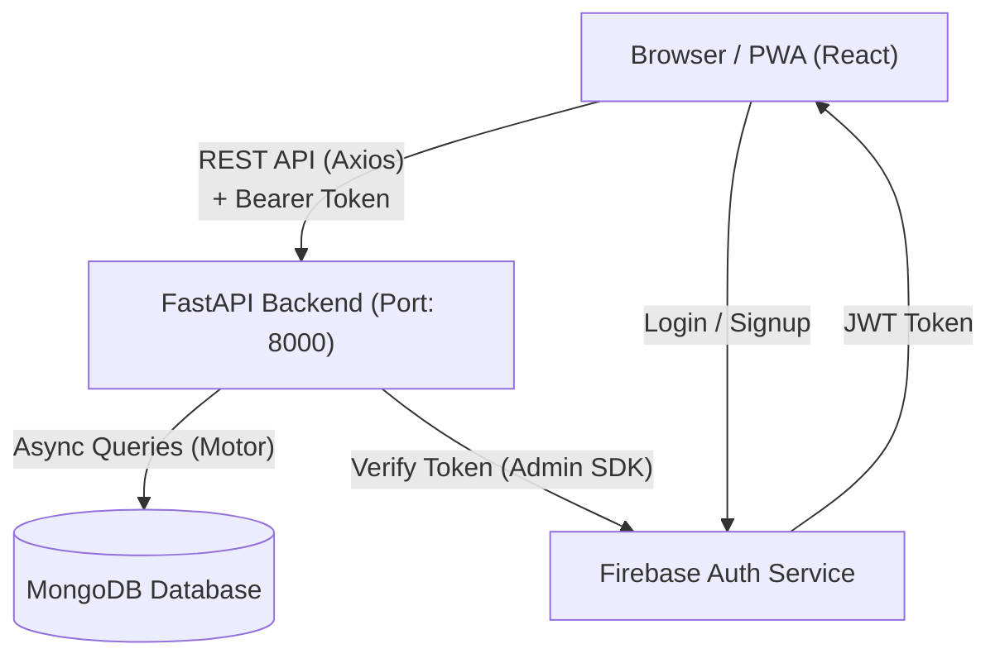

# 01. Architecture & Tech Stack

This document outlines the high-level architecture and technology stack of the TERRITORY (PropIt) platform.

## System Architecture

The TERRITORY platform is built using a modern, decoupled client-server architecture:

### 1. Frontend (Client)
The frontend is a Progressive Web App (PWA) built with **React 18** and **TypeScript**, bundled using **Vite**. It is responsible for rendering the UI, handling user interactions, and securely managing the Firebase JWT token in local storage.

### 2. Backend (Server)
The backend is a **FastAPI** application running on an ASGI server (**Uvicorn**). It provides RESTful endpoints, handles business logic (validation, search, transactions), and verifies incoming requests against Firebase. 

### 3. Database
The system uses **MongoDB**, a NoSQL document database. The backend communicates with MongoDB asynchronously using the **Motor** driver, ensuring non-blocking database operations, which is crucial for FastAPI's async performance.

### 4. Authentication Provider
**Firebase Authentication** handles the complexities of securely managing user credentials (email/password). The backend uses the `firebase-admin` SDK to verify the JWT tokens issued by the frontend.

## Technology Stack

| Layer | Technology | Primary Purpose |
|---|---|---|
| **Frontend Framework** | React 18 + TypeScript | Component-based UI building and type safety. |
| **Build Tool** | Vite | Lightning-fast Hot Module Replacement (HMR) and optimized production builds. |
| **Styling** | Tailwind CSS v4 + Vanilla CSS | Utility-first CSS framework for rapid UI development and custom themes. |
| **Routing** | React Router v6 | Client-side routing for navigating between pages without reloads. |
| **HTTP Client** | Axios | Making API requests and handling request/response interceptors (token injection, 401 handling). |
| **Backend Framework** | FastAPI | High-performance Python framework for building APIs, leveraging Python type hints for validation. |
| **ASGI Server** | Uvicorn | Running the FastAPI application asynchronously. |
| **Database Driver** | Motor | Asynchronous Python driver for MongoDB. |
| **Authentication** | Firebase Auth | Secure user identity management. |
| **Database** | MongoDB | Storing flexible schema documents (Users, Properties, Transactions). |

## Core Architectural Principles

* **Decoupled Architecture**: The frontend and backend are completely separate. They communicate strictly over HTTP REST APIs, allowing independent scaling and deployment.
* **Stateless Backend**: The FastAPI backend does not store session state. Every authenticated request must include a valid JWT Bearer token, which the backend verifies on the fly.
* **Async by Default**: The backend utilizes `async def` for route handlers and `await` for database operations (`AsyncIOMotorClient`). This prevents I/O blocking and allows the server to handle many concurrent connections efficiently.
* **Soft Deletes & State Machines**: Instead of deleting records outright, the system frequently relies on status transitions (e.g., `ACTIVE` -> `DELETE_REQUESTED` -> `SOLD_OUT`) to maintain historical integrity.

## Directory Structure Overview

The repository is divided into two primary directories, mirroring the decoupled architecture:

* `/backend/`: Contains all FastAPI server code, database configuration, Pydantic models, API routers, and python requirements.
* `/frontend/`: Contains the React application, Tailwind configuration, components, pages, and static assets.
