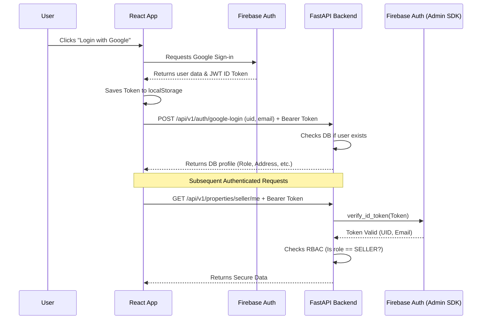

# 04. Authentication & Security

This document outlines how identity verification, session management, and endpoint security are handled in the TERRITORY (PropIt) platform.

## Architecture: Firebase + FastAPI

The platform relies on a hybrid authentication model: **Firebase Authentication** acts as the Identity Provider (IdP), while the **FastAPI backend** acts as the Resource Server that verifies the identity.

## 1. Client-Side Authentication (Frontend)

1. **Provider**: The frontend uses the Firebase JS SDK to authenticate users via Google.
2. **Token Storage**: Upon successful login, the Firebase ID token is retrieved and stored in the browser's `localStorage` as `token`.
3. **Axios Interceptor**: `frontend/src/lib/api.ts` defines an Axios request interceptor. Every outgoing HTTP request synchronously attaches the token in the `Authorization: Bearer <token>` header.
4. **Error Handling**: A response interceptor watches for `401 Unauthorized` responses. If a 401 is received (and it's not from an `/auth/` route), the app clears the token and redirects the user to the login screen.
5. **Protected Routes**: The `ProtectedRoute` component wraps secure pages. It checks for the token's presence and compares the user's role against the `requiredRole` prop before rendering.

## 2. Server-Side Verification (Backend)

The backend never trusts the client's claims. Every protected route depends on `get_current_user` in `routers/auth.py`.

### Token Verification Flow
1. **Dependency Injection**: Routes use `Depends(get_current_user)`.
2. **Extraction**: FastAPI's `OAuth2PasswordBearer` extracts the token from the HTTP header.
3. **Mock Tokens (Dev Only)**: The system currently supports hardcoded test tokens (`test-buyer-token`, `test-seller-token`, `test-admin-token`) to bypass Firebase during local development. *These must be disabled in production.*
4. **Firebase Admin SDK**: The token is passed to `auth.verify_id_token(token)` using the `firebase-admin` python library.
5. **Validation**: Firebase checks the signature, expiration date, and audience. If invalid, an exception is raised.
6. **Database Hydration**: If valid, the extracted `uid` is used to query the `users` collection in MongoDB. The full user document is attached to the request context.

### Access Control Exceptions
If a user is verified but their MongoDB record shows `role == "SELLER"` and `kyc_details.status != "APPROVED"`, the backend explicitly throws a `403 FORBIDDEN` error. This acts as a secondary failsafe to ensure unapproved sellers cannot access seller endpoints even if they manipulate local storage.

## 3. General Security Considerations

### CORS Configuration
The backend explicitly avoids using wildcard origins (`*`) with credentials enabled, as this is a major security vulnerability blocked by modern browsers. Instead, the `ALLOWED_ORIGINS` environment variable is used to dynamically construct the CORS middleware whitelist.

### Document Security
Property documents (e.g., Patta, Chitta) are not served as static files publicly. They are accessed via the `GET /api/v1/payments/document/{property_id}/{doc_index}` endpoint. 
* The endpoint checks the user's role.
* If the user is a `BUYER`, it queries the `transactions` table to ensure a `SUCCESS` record exists linking their `uid` to the `property_id`.
* Only then is the file streamed back to the client using FastAPI's `FileResponse`.

### File Uploads
Currently, files uploaded by sellers (images and documents) are saved directly to the local disk (`/uploads`).
* **Vulnerability**: Direct local storage without virus scanning or size limits can lead to Denial of Service or malware distribution. 
* **UUID Masking**: Files are renamed upon upload using `uuid.uuid4().hex` to prevent path traversal attacks and ensure no predictable patterns exist for scraping.
* **Roadmap**: Moving file uploads to a dedicated blob storage service (like AWS S3 or Cloudinary) is necessary for production security and scaling.

### Global Exception Handler
The backend utilizes a global exception handler (`@app.exception_handler(Exception)`). If an unhandled error occurs, the full traceback is logged *server-side* only. The client receives a generic `500 Internal Server Error` message. This prevents the leaking of sensitive stack traces, internal paths, or database structures to potential attackers.
