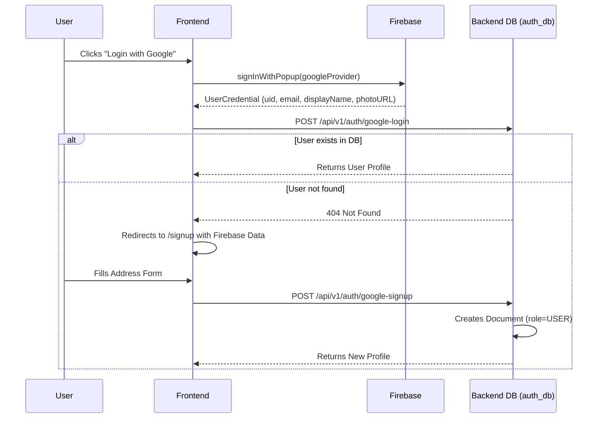

# 07a. User Registration & Seller Promotion Flow

This document details the lifecycle of a user account, from initial registration via Google to becoming an approved seller.

## 1. Initial Registration

The platform exclusively supports Google Sign-In for user authentication, delegating password management and email verification to Google/Firebase.

### The Address Requirement
Unlike many platforms where an address is optional, TERRITORY requires a physical address during the signup phase (`POST /google-signup`). This is stored as the primary `address` and also added to the `saved_addresses` array. 

## 2. Seller Promotion Workflow

By default, new users are assigned the `USER` role. To list properties, they must be promoted to the `SELLER` role.

> **Note on KYC:** Early iterations of this platform included a rigorous KYC (Know Your Customer) process requiring Aadhaar and PAN card details. **This requirement has been removed.** The system now relies on a simpler phone number verification step, and the backend mocks the legacy KYC fields as `"Google/Gmail Verified"` to maintain database schema compatibility.

### Requesting Promotion

1. A `USER` attempts to access a seller feature (e.g., clicking "Sell Land").
2. The frontend prompts them to enter a 10-digit Indian phone number.
3. The frontend calls `POST /api/v1/auth/become-seller` with the phone number.
4. The backend updates the user's document with the phone number.
5. The backend creates a new document in the `questions` collection with `status: "PENDING"`.
6. The user's frontend state is updated to show `is_seller_pending: true`, rendering a "Waiting for Admin Approval" banner.

### Admin Approval

1. The `ADMIN` logs into the Admin Dashboard and navigates to the "Seller Requests" tab.
2. The dashboard fetches pending requests via `GET /api/v1/admin/questions`.
3. The `ADMIN` clicks "Approve".
4. The frontend calls `PUT /api/v1/admin/questions/{id}/approve`.
5. The backend performs two atomic updates:
   * Sets the `question` status to `APPROVED`.
   * Updates the `users` document: changes `role` to `SELLER` and sets `kyc_details.status` to `APPROVED`.
6. The user is now officially a `SELLER` and can upload properties.

### Admin Rejection

If the `ADMIN` rejects the request (`PUT /api/v1/admin/questions/{id}/reject`), the `question` status changes to `REJECTED`, but the user's role remains `USER`. They must submit a new request if they wish to try again.
