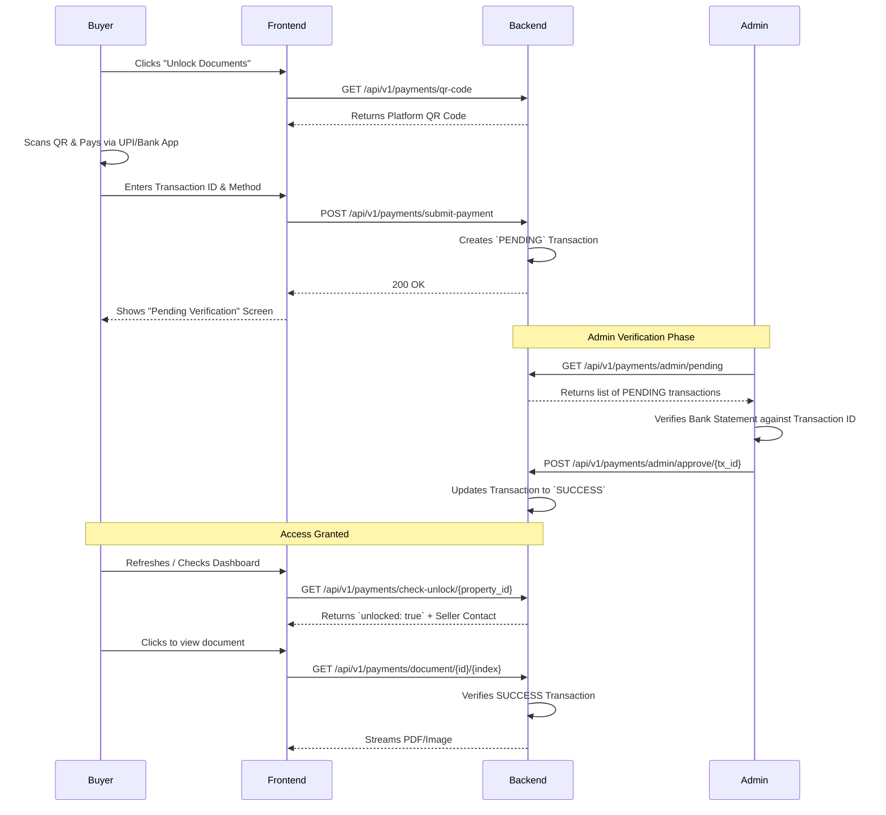

# 07d. Payment & Document Unlocking Flow

This document details the manual payment process required for a buyer to access a property's sensitive legal documents and the seller's contact information.

## 1. The Gateway Concept
In TERRITORY, a property's high-level details (area, price, location, photos) are public. However, the legal documents (Patta, Chitta) and the seller's phone number are locked behind a paywall (Rs. 500 flat fee per property).

## 2. The Manual Payment Workflow

The current production system utilizes a manual payment verification workflow via QR code.

### Submitting the Payment
When the buyer submits their transaction details (`POST /submit-payment`), the backend inserts (or upserts) a record into the `transactions` collection. 
Crucially, it **embeds a snapshot** of the property details (`property_details`), buyer info, and seller info into the transaction document. This ensures that historical receipts remain accurate even if the property is later modified or deleted.

### Admin Approval
The transaction remains in `PENDING` status until an admin verifies the payment in their real-world bank account and clicks "Approve" in the Admin Dashboard, switching the status to `SUCCESS`.

### Automatic Unlock Bypasses
The backend explicitly bypasses the transaction requirement for two roles:
1. **The Property Owner (SELLER)**: A seller inherently has access to the documents of their own listings. If the authenticated user's `uid` matches the `seller_id` on the property, access is granted.
2. **ADMIN**: Super-users bypass the paywall and can view documents across the entire platform for moderation purposes.

## 3. Secure Document Viewer
When a user attempts to view a document, the frontend routes them to `/viewer/:propertyId/:docIndex`.
Instead of requesting a public URL, the frontend makes an authenticated `GET` request to `/api/v1/payments/document/{property_id}/{doc_index}`. 
The backend verifies the `SUCCESS` transaction and uses `FileResponse` to stream the binary file directly to the browser. 

*(Note: The frontend includes a legacy `mock-unlock` endpoint which was used during the prototyping phase to simulate instant payments. The manual `submit-payment` flow is the intended production behavior).*
